# How to install GitLab using Docker Compose

## Configuration for Docker Compose
Create a dedicated directory for persisting Gitlab configuration and data:
```
$ mkdir -p ${HOME}/srv/gitlab
```

Define an environment variable ```GITLAB_HOME``` that references the GitLab directory:
```
$ export GITLAB_HOME=${HOME}/srv/gitlab
```

Create a ```docker-compose.yml``` file with the following content:
```
version: '3.8'
services:
  gitlab-ee:
    container_name: gitlab-ee
    image: gitlab/gitlab-ee:14.10.5-ee.0
    hostname: gitlab-ee
    restart: unless-stopped
    environment:
      GITLAB_OMNIBUS_CONFIG: |
        external_url 'http://localhost'
    ports:
      - '8080:80'
      - '8443:443'
    volumes:
      - '${GITLAB_HOME}/config:/etc/gitlab'
      - '${GITLAB_HOME}/logs:/var/log/gitlab'
      - '${GITLAB_HOME}/data:/var/opt/gitlab'
    networks:
      - gitlab
  gitlab-runner:
    container_name: gitlab-runner
    image: gitlab/gitlab-runner:alpine
    restart: unless-stopped
    depends_on:
      - gitlab-ee
    volumes:
      - /var/run/docker.sock:/var/run/docker.sock
      - '${GITLAB_HOME}/gitlab-runner:/etc/gitlab-runner'
    networks:
      - gitlab

networks:
  gitlab:
    name: gitlab-network
```

This configuration defines what containers we want to run. In our case, it will be the GitLab service with one GitLab runner (a separate module for running CI / CD tasks). The most important configuration parameters are:

- **image** – docker image that we want to use in our server
- **ports** – a list of ports that we make available outside the container. In our configuration, we provide ports ```80``` and```443```.
- **container_name** – the name of our container
- **volumes** – specifies the volumes that are used by the container. In our configuration, we have directories shared with our system (subdirectories in ```${GITLAB_HOME}```) and an additional volume that allows access to the Docker environment from the GitLab runner.
- **networks** – defines the virtual network in which the containers will operate. In our case, the ```gitlab-ee``` and ```gitlab-runner``` services communicate over the ```gitlab-network``` network.

## Gitlab installation
The containers are started using the command:
```
$ docker compose up -d
```

Once launched, the GitLab and GitLab Runner Docker images are downloaded and ran:
```
[+] Running 13/13
 ⠿ gitlab-ee Pulled                     53.4s
   ⠿ d7bfe07ed847 Pull complete          3.1s
   ⠿ 45cffd7b6f2d Pull complete          3.8s
   ⠿ fb6202988732 Pull complete          4.0s
   ⠿ 87e3fa11e7db Pull complete          4.2s
   ⠿ d439310cc733 Pull complete          4.4s
   ⠿ 36eb335cffee Pull complete          4.6s
   ⠿ 9177ea7d5f4a Pull complete          4.8s
   ⠿ d80ea14033b7 Pull complete         52.4s
 ⠿ gitlab-runner Pulled                  7.2s
   ⠿ df9b9388f04a Pull complete          1.9s
   ⠿ 10e0ed46598d Pull complete          5.9s
   ⠿ b7e27d159b54 Pull complete          6.0s
[+] Running 3/3
 ⠿ Network gitlab-network    Created     0.3s
 ⠿ Container gitlab-ee       Started    33.0s
 ⠿ Container gitlab-runner   Started     1.0s
```

To log in to GitLab for the first time, you need a temporary password, which is generated automatically during installation. The following command is used to get the temporary password:
```
$ docker exec -it gitlab-ee grep 'Password:' /etc/gitlab/initial_root_password
```

## GitLab portal
The GitLab portal is available at: ```http://localhost:8080```. After going to this address, the following screen should appear:

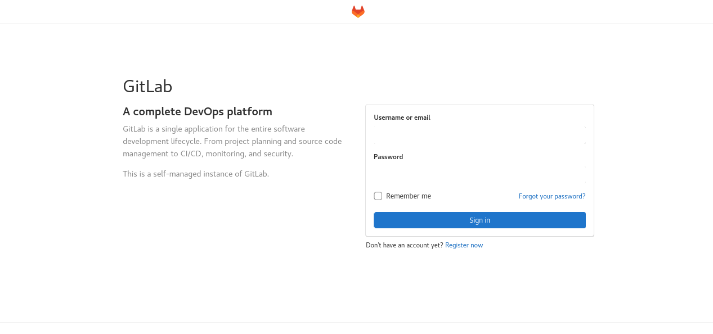

**Note**: The first launch of the portal may take several minutes.

To log in to the portal, enter ```root``` in ```Username``` field and the temporary password in the ```Password``` field. After logging in, the following screen should appear:

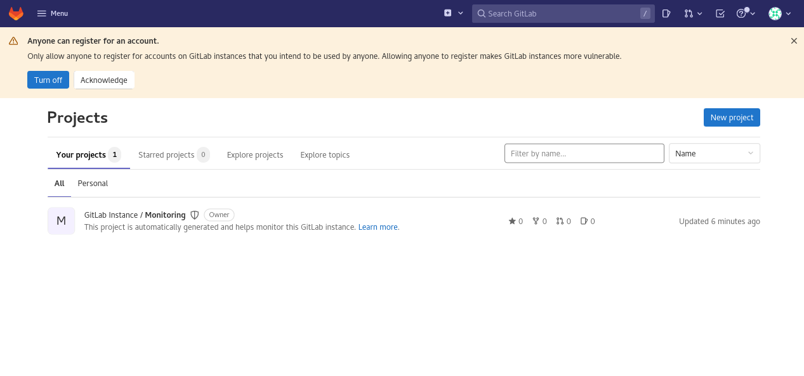

## Initial configuration of the portal
Before we proceed, it is worth changing a few portal settings. First, we’ll turn off open registration for everyone. To do this, click ```Turn off``` in upper bar warning message.  On the new page, uncheck ```Sign-up enabled``` and save the changes.

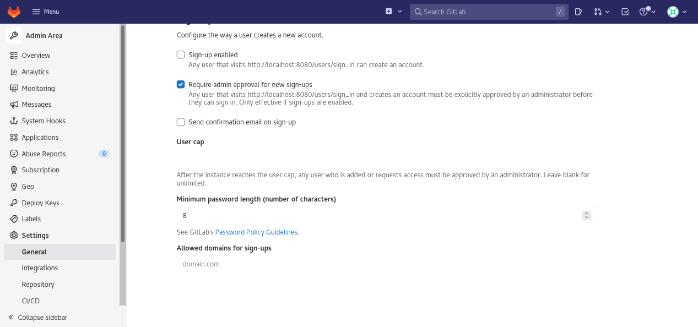

The next step should be to change the root user's password. To do this, http://localhost:8080/-/profile/password/edit:

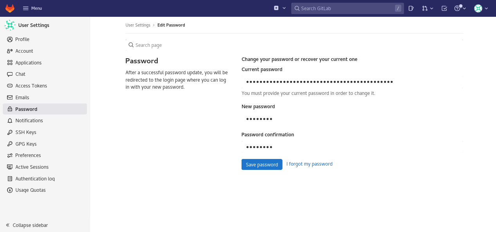

Enter the temporary password, obtained above, in the ```Current password``` field. Enter the new password in the ```New password``` and the ```Password confirmation``` fields.  Click ```Save password``` to commit the change.

## GitLab runner configuration
The GitLab runner must be configured before it can be used in GitLab. Obtain a registration token from the portal address http://localhost:8080/admin/runners by selecting ```Register an instance runner```, followed by ```Copy registration token```.

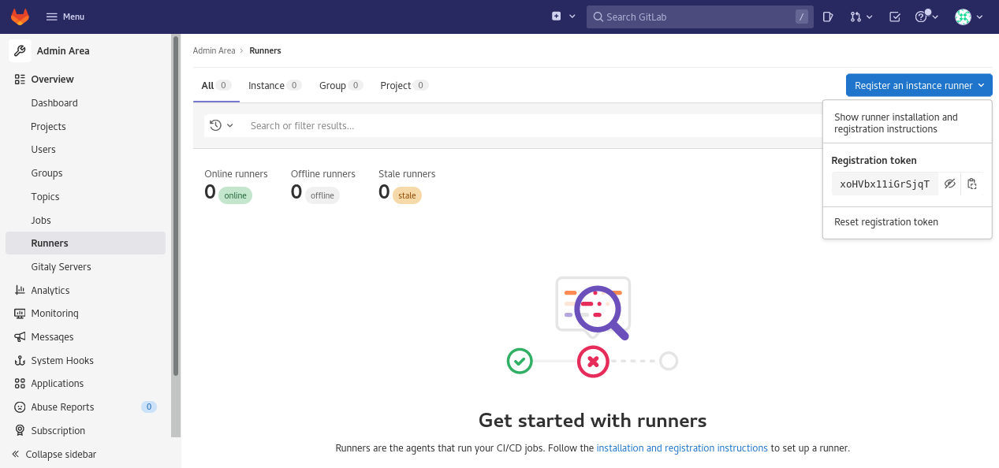

In our case, the registration token value is ```xoHVbx11iGrSjqTzXcWc```.  This value is used in configuration of the runner during the registration process.  Registration is done from the console using the following command:

```
$ docker exec -it gitlab-runner gitlab-runner register --url "http://gitlab-ee" --clone-url "http://gitlab-ee"
```

As prompted, enter the following information:

- **Enter the GitLab instance URL**: ```<enter>``` to accept default
- **Enter the registration token**: ```xoHVbx11iGrSjqTzXcWc```
- **Enter a description for the runner**: ```docker-runner```
- **Enter tags for the runner**: ```<enter>``` to leave  blank
- **Enter optional maintenance note for the runner**: ```<enter>``` to leave blank
- **Enter an executor**: ```docker```
- **Enter the default Docker image**: ```maven:latest```

In addition to the basic configuration, we also need to allow access for containers launched from the runner to the virtual network in which GitLab operates. This is done by editing the runner's config file:
```
$ sudo vi ${GITLAB_HOME}/gitlab-runner/config.toml
```

Add a new line to the end of the runner configuration file: ```network_mode = "gitlab-network"```.
```
concurrent = 1
check_interval = 0

[session_server]
  session_timeout = 1800

[[runners]]
  name = "docker-runner"
  url = "http://gitlab-ee"
  token = "..."
  executor = "docker"
  clone_url = "http://gitlab-ee"
  [runners.custom_build_dir]
  [runners.cache]
    [runners.cache.s3]
    [runners.cache.gcs]
    [runners.cache.azure]
  [runners.docker]
    tls_verify = false
    image = "maven:latest"
    privileged = false
    disable_entrypoint_overwrite = false
    oom_kill_disable = false
    disable_cache = false
    volumes = ["/cache"]
    shm_size = 0
    network_mode = "gitlab-network"
```

After registration, the registered runner will be displayed in the portal address http://localhost:8080/admin/runners:

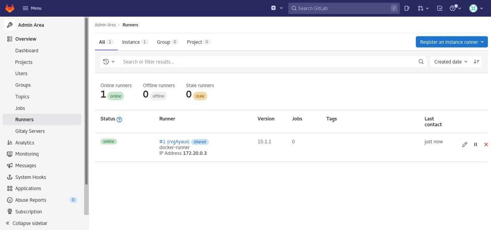

## Creating a repository
Create an example project by navigating to http://localhost:8080/projects/new and selecting ```Import project```:

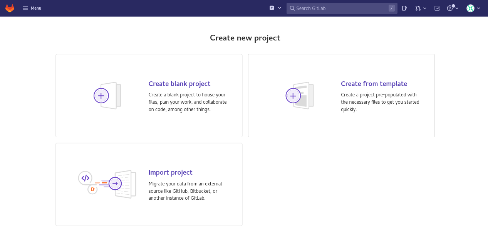

On the ```Import project``` page, select ```Repo by URL```.  Enter https://github.com/jefferyedwards/helloworld in the ```Git repository URL``` text field.  This will import the existing ```helloworld``` project into our GitLab instance.

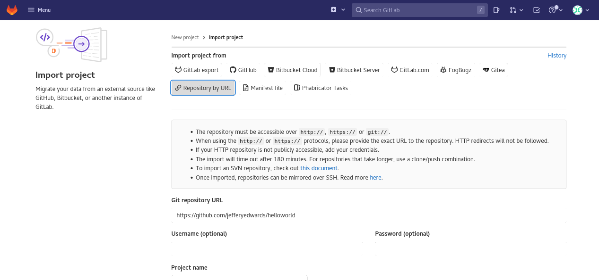

After importing, the project will be displayed in list of available projects in the portal address http://localhost:8080/dashboard/projects:

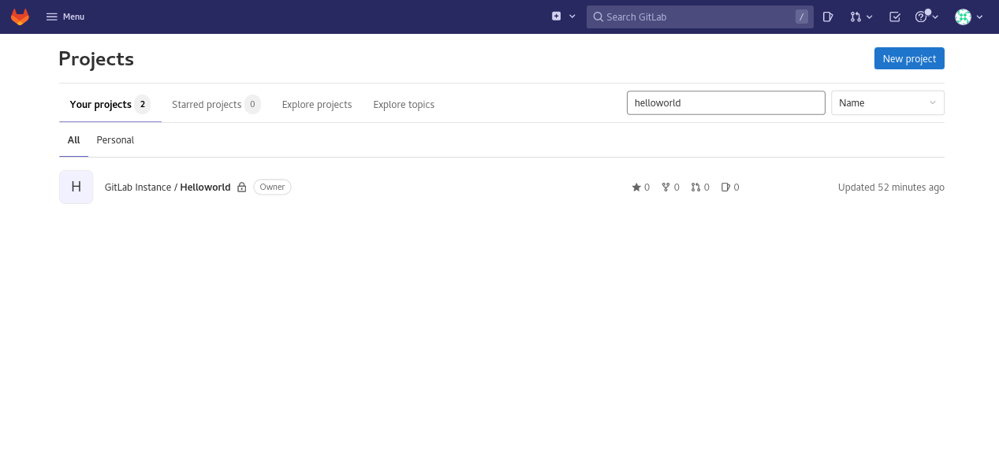

The ```helloworld``` project in GitLab:

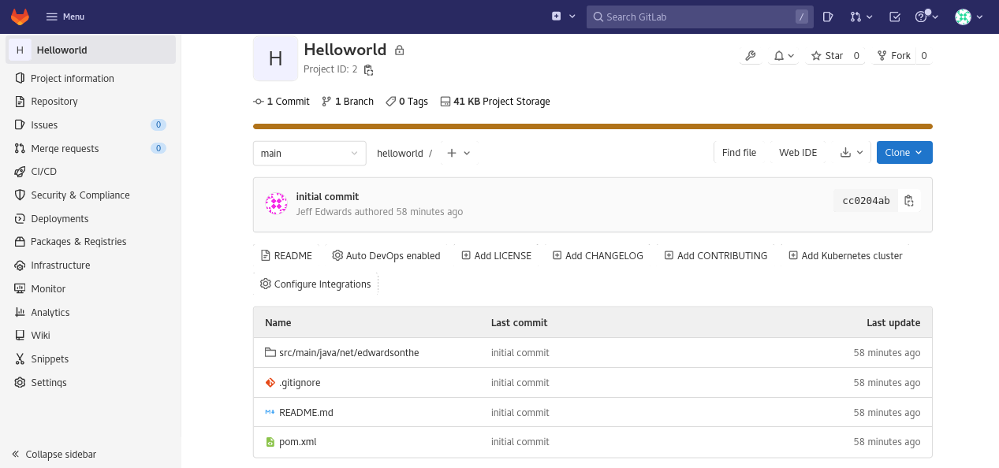

## Create the CI/CD pipeline
To create a CI/CD pipeline for the project, click the ```main``` menu on the left, then ```CI/CD | Editor```.

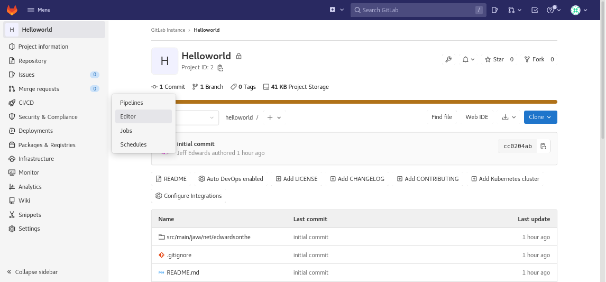

Select ```Configure pipeline``` to create a ```.gitlab-ci.yml``` file, which will contain our pipeline definitions, will appear on the screen.

Enter the following in the pipeline editor text area:
```
image: maven:latest

stages:
  - build
  - test

build-job:
  stage: build
  script:
    - echo "Compiling the code..."
    - mvn clean package
    - echo "Compile complete."
  artifacts:
    paths:
    - target   

test-job:
  stage: test
  dependencies: 
    - build-job  
  script:
    - ls -al
    - echo "Running tests"
    - java -cp target/helloworld-1.0.0.jar net.edwardsonthe.HelloWorld
```

The above definition describes how the CI/CD process should work. The most important elements are:

- **image**: docker image that we will use to build our project
- **stages**: a list of our process steps
- **build-job**: the first step in our process to build our project. Additionally, we save the artifacts for use in the next step
- **test-job**: the second step to run our project

Update the pipeline definition and confirm the changes by selecting ```Commit changes```:

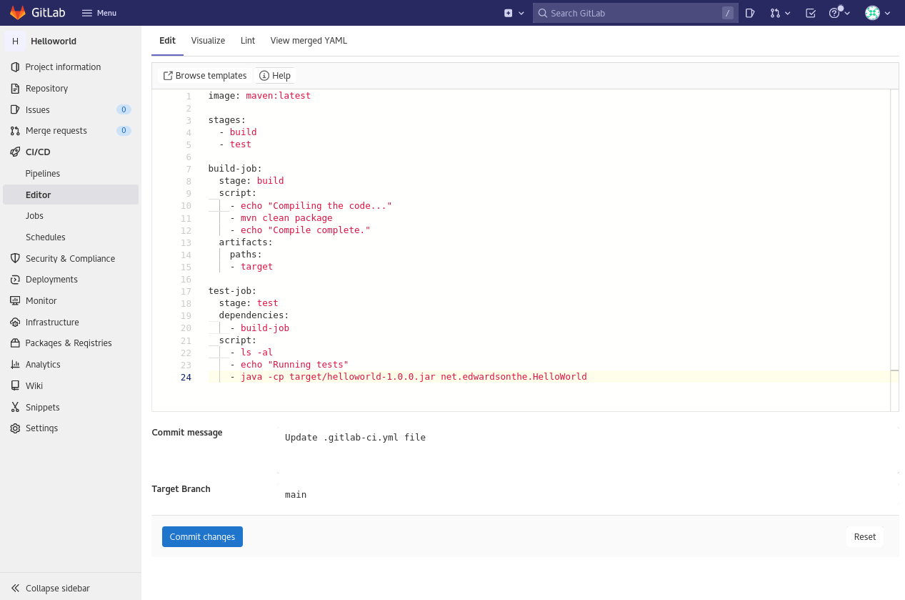

After a while, the task should be built and tested:

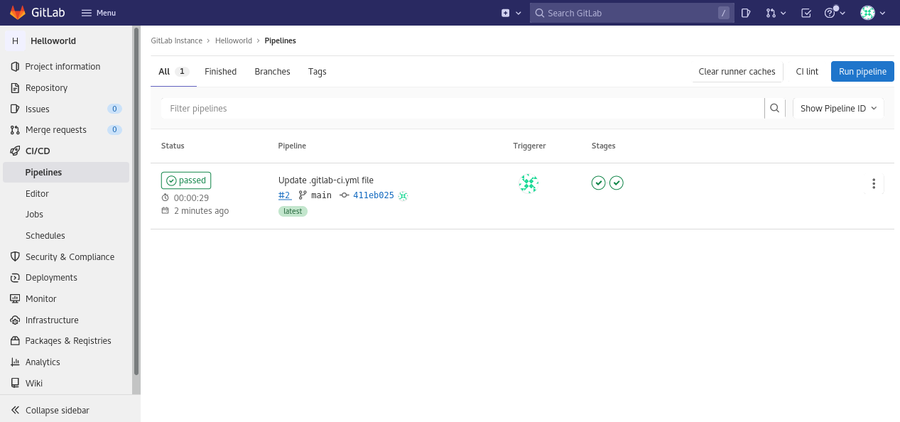

The ```Jobs``` page reflects the jobs, in our case ```test-job``` and ```build-job```, along with their corresponding execution status.

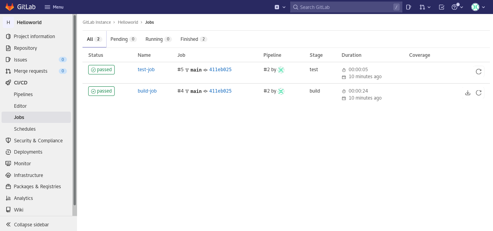

Logging from a given job can be viewed by selecting its name.  For example, the ```build-job``` logs:

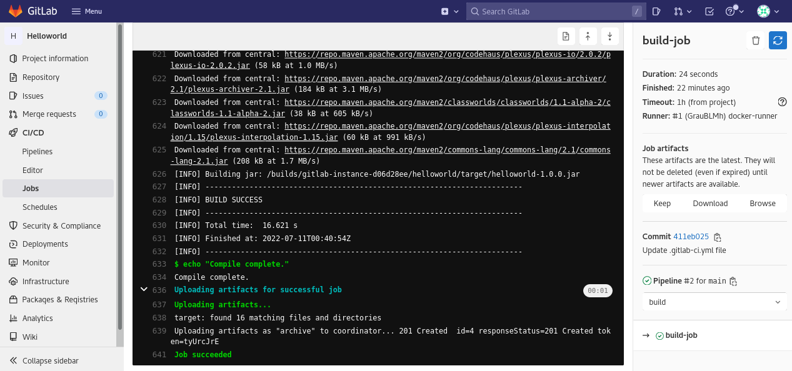

Congratulations! You have just created your first CI/CD job in GitLab!

## Stopping the container
The containers containing our service were launched with the switch causing the work in the background. If you want to stop the portal, execute the following command:
```
$ docker compose down
```

## Summary
This tutorial provides details on the configuration of GitLab with a single shared GitLab runner. The GITLAB_HOME environment variable defined the host path for persisting of GitLab service data.  Therefore, data is not deleted when the containers are stopped or removed.